<!--
  Profile art generators:
    python scripts/prep_photo.py source-photo.jpg
    python scripts/make_ascii_svg.py
    python scripts/make_info_card.py
    python scripts/fetch_contributions.py && python scripts/render_heatmap_svg.py
  All identity/bio content lives in scripts/profile_config.py
-->

<table>
  <tr>
    <td>
      
    </td>
    <td>
      
    </td>
  </tr>
</table>

## Manan Paliwal

**DevOps & Cloud Platform Engineer · Building at Kadel Labs**

 

