<!--
  Profile art generators:
    python scripts/prep_badge.py
    python scripts/make_control_room.py
    python scripts/make_mission_dossiers.py
    python scripts/fetch_contributions.py && python scripts/render_heatmap_svg.py
    python scripts/fetch_ops_log.py
  All identity / panel content lives in scripts/profile_config.py
-->

## Manan Paliwal

**DevOps & Cloud Platform Engineer · Building at Kadel Labs**

 

 

### Ops log

<!-- START_SECTION:ops_log -->
- `2026-08-06 · pushed to maannaan/Deplot`
- `2026-08-06 · created branch main on maannaan/Deplot`
- `2026-08-03 · pushed to maannaan/CloudForge`
- `2026-08-03 · created branch main on maannaan/CloudForge`
- `2026-07-25 · pushed to maannaan/maannaan`
- `2026-07-25 · created branch main on maannaan/maannaan`
<!-- END_SECTION:ops_log -->
